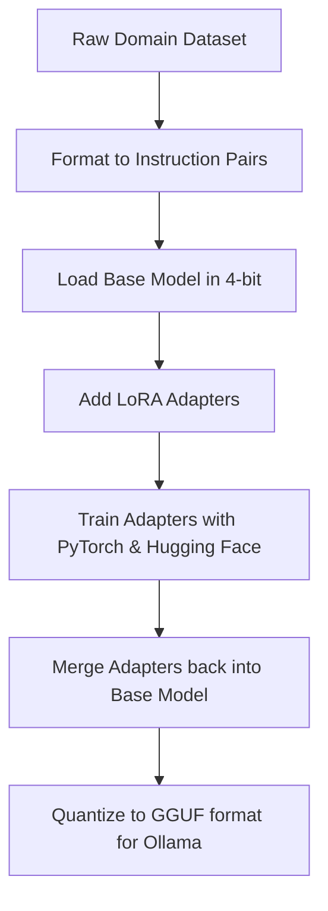

While frontier models like GPT-4o are capable of general-purpose tasks, their size makes running them on edge devices impossible. Enter **Small Language Models (SLMs)**. 

Models in the 1B to 8B parameter range, such as Microsoft's **Phi-3** or Meta's **Llama-3-8B**, offer impressive performance. When fine-tuned for a specific domain, they can outperform general models several times their size. 

In this research guide, we will walk through fine-tuning an SLM using **QLoRA (Quantized Low-Rank Adaptation)** on standard consumer hardware.

---

## What is QLoRA?

Fine-tuning a model traditionally requires updating billions of parameters, which consumes hundreds of gigabytes of VRAM. **QLoRA** optimizes this process by:
1. Quantizing the base model weights to 4-bit precision (reducing memory footprint by ~75%).
2. Freezing the base model parameters.
3. Adding tiny, trainable adapters (Low-Rank Adaptation) that capture domain knowledge during training.

This enables developers to fine-tune an 8B model on a single consumer GPU with only 12GB to 16GB VRAM.

---

## The Fine-Tuning Pipeline

Here is a typical QLoRA fine-tuning workflow:



---

## Step-by-Step Implementation

We'll use Python, PyTorch, and Hugging Face's `transformers` library to fine-tune **Phi-3-mini** (3.8B parameters) for code review assistance.

### 1. Requirements Installation

First, install the necessary libraries in your Python environment:

```bash
pip install torch transformers peft bitsandbytes datasets trl
```

### 2. Loading the Model in 4-bit

We utilize `bitsandbytes` to load the base model in quantized 4-bit mode:

```python
import torch
from transformers import AutoModelForCausalLM, AutoTokenizer, BitsAndBytesConfig

model_id = "microsoft/Phi-3-mini-4k-instruct"

# Configure 4-bit quantization
bnb_config = BitsAndBytesConfig(
    load_in_4bit=True,
    bnb_4bit_use_double_quant=True,
    bnb_4bit_quant_type="nf4",
    bnb_4bit_compute_dtype=torch.bfloat16
)

# Load base model and tokenizer
model = AutoModelForCausalLM.from_pretrained(
    model_id,
    quantization_config=bnb_config,
    device_map="auto"
)
tokenizer = AutoTokenizer.from_pretrained(model_id)
tokenizer.pad_token = tokenizer.eos_token
```

### 3. Setting Up LoRA Adapters

Next, we configure the parameter-efficient adapters:

```python
from peft import LoraConfig, get_peft_model

peft_config = LoraConfig(
    r=16,                         # Rank
    lora_alpha=32,                # Scaling factor
    target_modules=["qkv_proj"],  # Target attention layers in Phi-3
    lora_dropout=0.05,
    bias="none",
    task_type="CAUSAL_LM"
)

model = get_peft_model(model, peft_config)
model.print_trainable_parameters()
```
*Output: trainable params: 3,745,280 || all params: 3,821,079,040 || trainable%: 0.098%*

We are training less than **0.1%** of the model's total parameters!

### 4. Running the Training

Using Hugging Face's `SFTTrainer` (Supervised Fine-Tuning Trainer):

```python
from trl import SFTTrainer
from transformers import TrainingArguments
from datasets import load_dataset

dataset = load_dataset("json", data_files="code_review_data.json")

training_args = TrainingArguments(
    output_dir="./phi3-code-reviewer",
    per_device_train_batch_size=4,
    gradient_accumulation_steps=4,
    learning_rate=2e-4,
    logging_steps=10,
    max_steps=100,
    optim="paged_adamw_32bit",
    fp16=True
)

trainer = SFTTrainer(
    model=model,
    train_dataset=dataset["train"],
    dataset_text_field="text",
    max_seq_length=512,
    tokenizer=tokenizer,
    args=training_args
)

trainer.train()
```

---

## Deploying to Edge Devices

Once training completes and you merge the adapters, you can export the model to GGUF format using `llama.cpp` and run it on a phone, Raspberry Pi, or local PC using **Ollama**.

This allows for fully offline, specialized, and cost-free execution in mobile apps, field devices, or highly secure enterprise servers.
