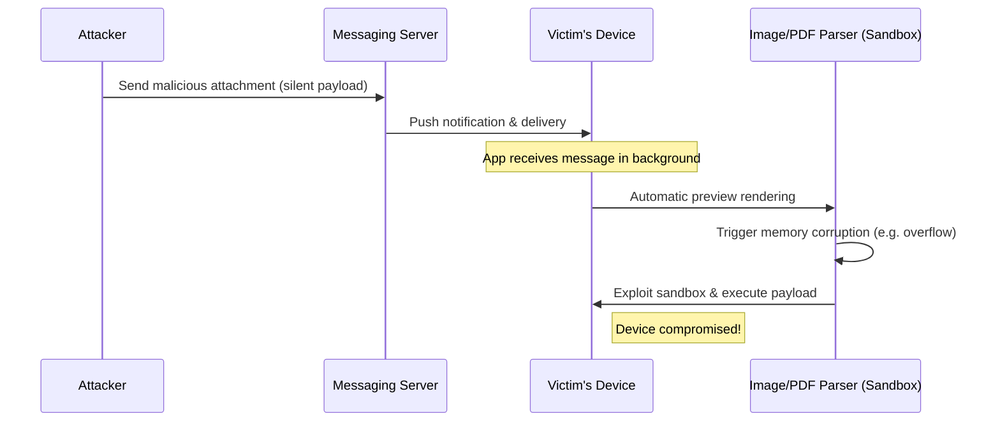

Zero-click vulnerabilities represent the absolute pinnacle of cyber-exploitation. Unlike typical phishing links or malicious attachments, a **zero-click exploit** requires absolutely no interaction from the victim. The device is compromised simply by receiving a message.

In this research article, we will dissect the architecture of zero-click vulnerabilities, explore why messaging apps are targeted, and examine historical exploits like Apple's **FORCEDENTRY**.

---

## What is a Zero-Click Exploit?

A zero-click exploit targets background parsing services. When an app receives a message containing rich media (like an image, video, PDF, or document), it automatically processes the file to render a preview, generate a thumbnail, or index metadata.

If the parser handling this media contains a memory safety vulnerability (like an integer overflow, buffer overflow, or use-after-free), a specially crafted file can trigger code execution before the user even unlocks their phone.

---

## Anatomy of FORCEDENTRY (CVE-2021-30860)

One of the most sophisticated zero-click exploits in history was **FORCEDENTRY**, deployed against iOS devices. Let's look at the attack vector:

1. **The Entry Point**: The exploit was delivered via iMessage. iMessage automatically parses incoming attachments (like images) using a framework called `IMTranscoderAgent`.
2. **The Bypass**: The exploit sent a malicious `.pdf` disguised as a `.gif`. The file bypasses checking filters because iMessage identified it as a GIF, but routed the file to the PDF parsing engine (**CoreGraphics**).
3. **The Vulnerability**: CoreGraphics used a JBIG2 parser (an old black-and-white compression format). The JBIG2 parser contained an integer overflow vulnerability that allowed out-of-bounds writes.
4. **Logical Computing**: The attackers used JBIG2 commands to build an entire virtual machine in memory, constructing custom logical gates (`AND`, `OR`, `XOR`) using memory buffer operations. This virtual machine was then used to exploit the device, bypass kernel protections, and run the spyware payload.

---

## Why Messaging Apps are Vulnerable

### 1. Massive Attack Surface
Modern messaging apps support an array of formats: GIFs, stickers, animated webp files, audio files, voice notes, location coordinates, contact cards, and PDF files. Each of these formats requires a dedicated parsing library, often written in C or C++ for performance.

### 2. Auto-Execution
To maintain a smooth UX, preview rendering must happen in the background immediately. This eliminates the chance for user discretion (like "Do not open files from unknown senders").

### 3. Native Integration
These applications run close to the operating system to send native push notifications and manage device storage, increasing the damage potential if the app container is compromised.

---

## Mitigating the Risk

### 1. Memory-Safe Languages
The industry is slowly shifting toward rewriting media decoders in memory-safe languages like **Rust** or **Go**. If a parser is memory-safe, buffer overflows result in clean application crashes rather than arbitrary code execution.

### 2. Blast Door Architectures
Apple introduced **BlastDoor** in iOS 14, a heavily sandboxed Swift service responsible for parsing all untrusted data in iMessage. The service strips away entitlements, making it extremely difficult for an attacker to escalate privileges even if they corrupt the parser's memory.

### 3. Lockdown Modes
For high-risk individuals (journalists, politicians, activists), OS-level "Lockdown Modes" disable previews, block complex fonts, and turn off parsing of arbitrary attachments entirely.

---

## Conclusion

Zero-clicks illustrate that security is only as strong as your weakest dependency. So long as operating systems automatically pass untrusted binary files to legacy C/C++ parsers, zero-click vulnerabilities will remain a primary weapon for advanced threat groups.
