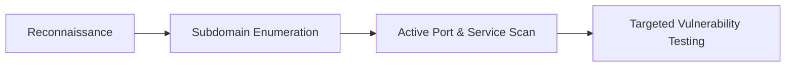

Bug bounty hunting is a race against time and other researchers. To find vulnerabilities before anyone else, you need a workflow that is fast, automated, and deep. 

In this article, I will share the exact toolchain I use for modern reconnaissance, vulnerability scanning, and local exploit development.

---

## The Hacking Workflow

A structured bug bounty pipeline consists of four major stages:



---

## 1. Reconnaissance & Asset Discovery

Recon is the foundation of any bug bounty methodology. If you find an asset that everyone else missed, you'll find vulnerabilities that everyone else missed.

### Subfinder
Developed by ProjectDiscovery, **Subfinder** is a fast subdomain discovery tool that queries passive sources.

```bash
subfinder -d target.com -o subdomains.txt
```

### Amass
OWASP's **Amass** uses active and passive techniques, including DNS scraping, archive searches, and API integration, to build an in-depth map of target attack surfaces.

```bash
amass enum -active -d target.com -o amass_subs.txt
```

---

## 2. Port Scanning & Service Probe

Once subdomains are mapped, you need to identify what services are running.

### Naabu
**Naabu** is a fast port scanner written in Go, designed to scan thousands of hosts quickly and reliably.

```bash
naabu -list subdomains.txt -c 50 -rate 1000 -o ports.txt
```

### HTTPX
**HTTPX** is a multipurpose HTTP toolkit that resolves subdomains, checks headers, determines technologies used (Wappalyzer integration), and extracts title tags.

```bash
httpx -l ports.txt -title -status-code -tech-detect -o live_web.txt
```

---

## 3. Targeted Vulnerability Scanning

I avoid generic, heavy scanners. Instead, I use template-based scanners to target specific vulnerabilities.

### Nuclei
**Nuclei** allows sending requests across targets using YAML-based templates. This is perfect for scanning for specific zero-days or configuration errors instantly.

```bash
nuclei -l live_web.txt -t cves/ -severity critical,high -o vulnerabilities.txt
```

> [!TIP]
> Keep your Nuclei templates updated. You can run `nuclei -update-templates` to pull the latest community-contributed templates.

---

## 4. Exploit Development & Interception

For local analysis, reversing, and manual exploit payload crafting:

### Burp Suite Professional
The absolute gold standard for web application pentesting. Its repeater, intruder, and custom BChecks make intercepting and manipulating HTTP traffic extremely efficient.

### Ghidra
A software reverse-engineering suite created by the NSA. Perfect for analyzing binaries, decompiling buffer overflows, and searching for logic bugs in desktop apps.

---

## Summary Table

| Tool | Focus | Language | Strengths |
| :--- | :--- | :--- | :--- |
| **Subfinder** | Subdomain discovery | Go | Extremely fast passive discovery |
| **Amass** | Attack surface mapping | Go | Massive data source integration |
| **Naabu** | Port scanning | Go | High-performance raw socket scanning |
| **HTTPX** | Web server probing | Go | Header and technology analysis |
| **Nuclei** | Vulnerability scanning | Go | YAML templates, highly customizable |
| **Burp Suite** | Traffic interception | Java | Best-in-class proxy, repeater & macros |

By chaining these tools together with simple shell scripts, you can build a highly automated reconnaissance loop that flags vulnerabilities the second a target deploys new code.
