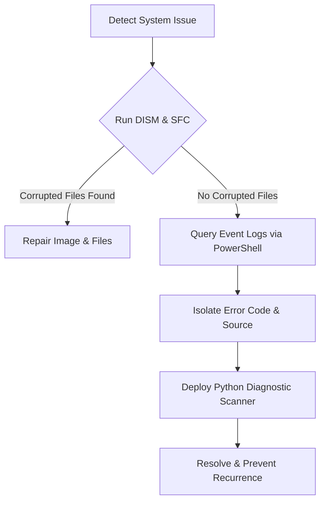

Windows is a complex environment. When developing systems applications, deploying virtual machines, or running heavy compilation tasks, system bottlenecks and driver conflicts can emerge. 

In this article, I will share the exact command-line troubleshooting pipelines I use to fix Windows issues, analyze event logs, and build an automated **Python-based diagnostic scanner** to pinpoint system errors.

---

## The System Diagnostic Process

When a Windows server or workstation exhibits instability, I follow a logical, multi-layered validation sequence:



---

## 1. Filesystem & Image Repair Pipelines

Before diving into logs, ensure the operating system's integrity is intact. System corruption can cause weird application crashes that seem like code bugs.

Open **PowerShell** or **Command Prompt** as Administrator and run the following sequential commands:

### Step A: Check and Repair System Image
The **DISM** tool checks the local Windows Component Store for corruption and restores healthy files using Windows Update.

```powershell
# Scan the image health without modifying files
DISM /Online /Cleanup-Image /ScanHealth

# Restore system health by replacing corrupted packages
DISM /Online /Cleanup-Image /RestoreHealth
```

### Step B: Run System File Checker
Once the component store is repaired, scan and fix protected system files.

```powershell
sfc /scannow
```

---

## 2. Event Log Queries with PowerShell

Windows Event Logs store millions of lines of boot, driver, and system status information. Instead of opening the heavy Event Viewer GUI, you can query events instantly using PowerShell.

### Query Critical and Error System Events
The following command fetches the 10 most recent error-level logs from the System log:

```powershell
Get-WinEvent -LogName System -MaxEvents 10 | Where-Object { $_.LevelDisplayName -eq "Error" -or $_.LevelDisplayName -eq "Critical" } | Format-Table TimeCreated, ProviderName, Message -Wrap
```

### Find System Shutdown & BSOD Reason Codes
To find why a machine rebooted unexpectedly (such as a Blue Screen of Death):

```powershell
Get-WinEvent -FilterHashtable @{LogName='System'; Id=6008, 1001} -MaxEvents 5 | Format-List TimeCreated, Message
```
* **Event ID 6008**: Unexpected shutdown (e.g., power loss).
* **Event ID 1001**: Bugcheck / BSOD analysis logging.

---

## 3. Developing a Python Log Analyzer Tool

As a developer, manual searches are inefficient. We can build a **Python diagnostic script** that parses Windows Event logs (using `subprocess` or `win32evtlog`), extracts critical errors, and uses AI-like regex filtering to propose solutions.

Here is a robust script that runs natively on Windows to monitor system logs:

```python
import subprocess
import json
import re

def get_critical_logs():
    print("[*] Launching Windows Event Log Analysis...")
    
    # PowerShell command to fetch recent critical errors formatted as JSON
    ps_command = (
        "Get-WinEvent -LogName System -MaxEvents 5 | "
        "Where-Object { $_.Level -le 2 } | "
        "Select-Object TimeCreated, ProviderName, Id, Message | "
        "ConvertTo-Json"
    )
    
    try:
        result = subprocess.run(
            ["powershell", "-Command", ps_command],
            capture_output=True,
            text=True,
            check=True
        )
        
        if not result.stdout.strip():
            print("[+] No critical errors found in recent logs.")
            return []
            
        logs = json.loads(result.stdout)
        return logs if isinstance(logs, list) else [logs]
        
    except subprocess.CalledProcessError as e:
        print(f"[-] Failed to execute query: {e}")
        return []

def diagnose_errors(logs):
    # Quick regex match for common error patterns
    diagnostics = {
        "DCOM": "Distributed COM authorization issue. Check Registry Component Services (dcomcnfg).",
        "Kernel-Power": "Power supply fluctuation or forced reboot. Check hardware power draw or UPS.",
        "Disk": "Hard drive bad sectors detected. Run 'chkdsk /f /r' immediately.",
        "ntfs": "Filesystem structural damage. Run 'chkdsk /f'."
    }
    
    for log in logs:
        provider = log.get("ProviderName", "")
        message = log.get("Message", "")
        event_id = log.get("Id", "")
        
        print(f"\n[!] Error Detected - Event ID {event_id} (Provider: {provider})")
        print(f"    Message: {message[:120]}...")
        
        # Analyze log pattern
        matched = False
        for key, fix in diagnostics.items():
            if key.lower() in provider.lower() or key.lower() in message.lower():
                print(f"    💡 Solution Proposal: {fix}")
                matched = True
                break
        if not matched:
            print("    💡 Solution Proposal: Search Microsoft Support for this event code.")

if __name__ == "__main__":
    logs = get_critical_logs()
    if logs:
        diagnose_errors(logs)
```

### Extending with Flutter & Cross-Platform UI
By compiling this script into a binary (using `PyInstaller`), you can wrap it in a **Flutter Desktop Application** wrapper. In Flutter, you use `Process.run` to call the diagnostic tool and render the proposed fixes in a beautiful dark-mode interface, allowing users to solve complex Windows problems with a single click.

---

## 4. General Problem Solving Checklist

No matter what environment or programming language you are using, systematic troubleshooting follows these core guidelines:

1. **Verify the environment**: Are dependencies loaded? Is the file system path relative or absolute?
2. **Read the traceback from bottom to top**: The actual crash root-cause is almost always at the very bottom of the log file.
3. **Isolate variables**: Comment out complex logic block-by-block, or isolate network connections to prove where the failure is occurring.
4. **Use System Sandboxing**: Test code inside a Windows Sandbox or clean Docker container to make sure local computer configs aren't masking bugs.

By leveraging simple command line commands, automated Python scripting, and modular application design, you can automate away system troubleshooting and focus on building high-performance solutions.
